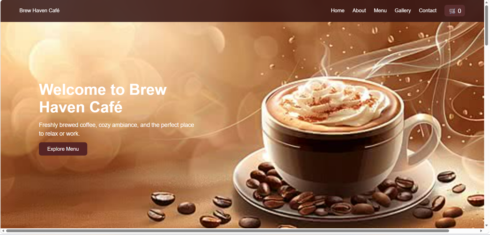
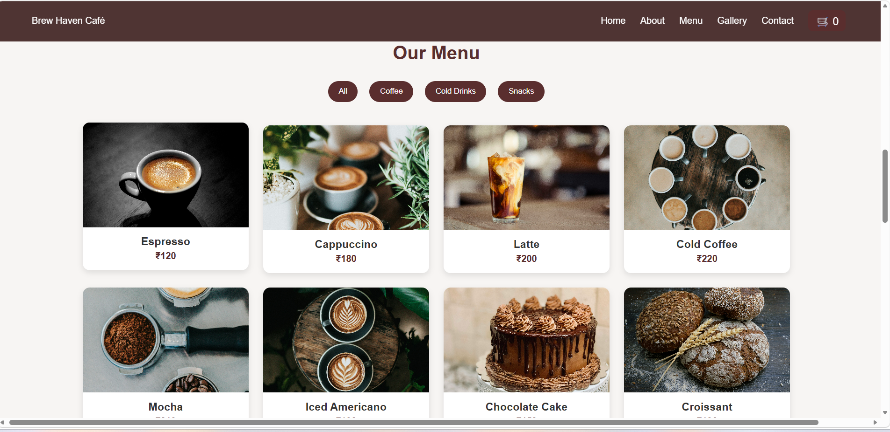
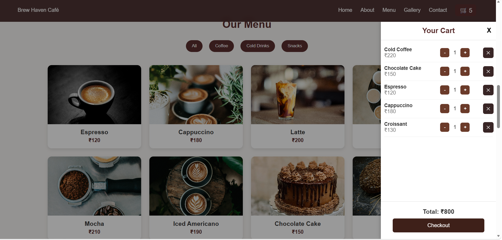
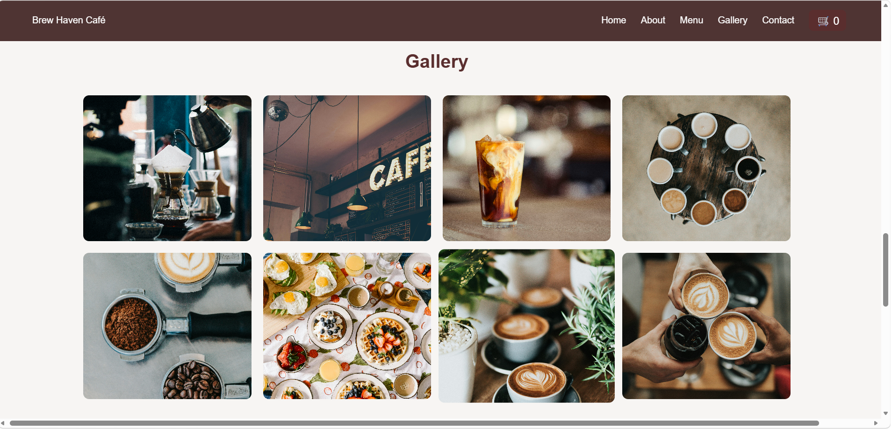
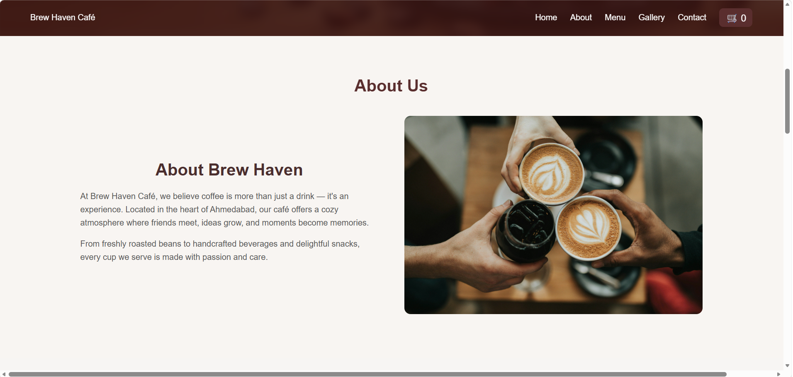

# ☕ Brew Haven Cafe Website

A modern cafe website built using React and Node.js.  
This project was created as part of the Future Interns Full Stack Development Task.

---

## 🚀 Features

- Modern responsive UI
- Interactive cafe menu
- Add to Cart functionality
- Sliding Cart Panel
- Order Confirmation Popup
- Order Success Animation
- Image Gallery
- Customer Testimonials
- Contact Form
- Smooth animations using AOS

---

## 🛠️ Technologies Used

Frontend:
- React.js
- CSS3
- AOS Animation Library

Backend:
- Node.js
- Express.js
- MongoDB

---

## 📂 Project Structure

```
src
 ├── components
 │   ├── Navbar
 │   ├── Home
 │   ├── About
 │   ├── Menu
 │   ├── Gallery
 │   ├── Testimonials
 │   ├── Contact
 │   ├── Cart
 │   └── Footer
```

---

## 🛒 Key Feature: Cart System

Users can:

- Add menu items to cart
- Increase / decrease quantity
- Remove items
- View total price
- Confirm order
- See order success animation

---

## 📸 Screenshots

### Home Page


### Menu Section


### Cart Panel


### Gallery


### About



---

## ⚙️ Installation

Clone the repository:

```
git clone https://github.com/Nisha26-mudaliar/FUTURE_FS_03.git
```

Install dependencies:

```
npm install
```

Run the project:

```
npm run dev
```

---

## 📌 Internship Task

This project was built for **Future Interns - Full Stack Development Task 3 (2026)**.

---

## 👩‍💻 Author

Nisha Mudaliar